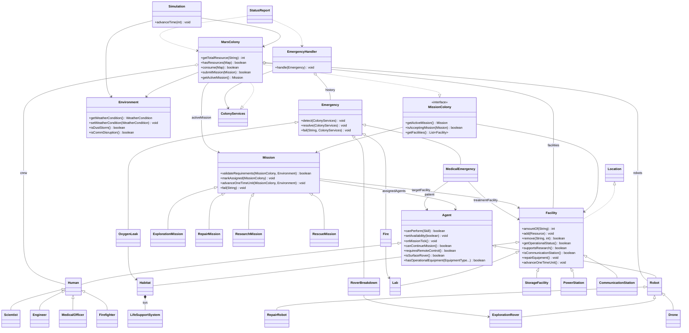

# Full Merged Class Diagram

```mermaid
classDiagram
    class Agent {
      +canPerform(Skill) boolean
      +setAvailability(boolean) void
      +onMissionTick() void
      +canContinueMission() boolean
      +requiresRemoteControl() boolean
      +isSurfaceRover() boolean
      +hasOperationalEquipment(EquipmentType...) boolean
    }
    class Human
    class Robot
    class Facility {
      +amountOf(String) int
      +add(Resource) void
      +remove(String, int) boolean
      +getOperationalStatus() boolean
      +supportsResearch() boolean
      +isCommunicationStation() boolean
      +repairEquipment() void
      +advanceOneTimeUnit() void
    }
    class Location
    class MarsColony {
      +getTotalResource(String) int
      +hasResources(Map) boolean
      +consume(Map) boolean
      +submitMission(Mission) boolean
      +getActiveMission() Mission
    }
    class MissionColony {
      <<interface>>
      +getActiveMission() Mission
      +isAcceptingMission(Mission) boolean
      +getFacilities() List~Facility~
    }
    class Mission {
      +validateRequirements(MissionColony, Environment) boolean
      +markAssigned(MissionColony) void
      +advanceOneTimeUnit(MissionColony, Environment) void
      +fail(String) void
    }
    class Environment {
      +getWeatherCondition() WeatherCondition
      +setWeatherCondition(WeatherCondition) void
      +isDustStorm() boolean
      +isCommDisruption() boolean
    }
    class Simulation {
      +advanceTime(int) void
    }
    class Emergency {
      +detect(ColonyServices) void
      +resolve(ColonyServices) void
      +fail(String, ColonyServices) void
    }
    class EmergencyHandler {
      +handle(Emergency) void
    }
    class ColonyServices
    class Habitat
    class LifeSupportSystem
    class Lab
    class StorageFacility
    class PowerStation
    class CommunicationStation
    class Scientist
    class Engineer
    class MedicalOfficer
    class Firefighter
    class ExplorationRover
    class RepairRobot
    class Drone
    class ExplorationMission
    class RepairMission
    class ResearchMission
    class RescueMission
    class OxygenLeak
    class Fire
    class RoverBreakdown
    class MedicalEmergency
    class StatusReport

    Agent <|-- Human
    Agent <|-- Robot
    Human <|-- Scientist
    Human <|-- Engineer
    Human <|-- MedicalOfficer
    Human <|-- Firefighter
    Robot <|-- ExplorationRover
    Robot <|-- RepairRobot
    Robot <|-- Drone
    Facility <|-- Habitat
    Facility <|-- Lab
    Facility <|-- StorageFacility
    Facility <|-- PowerStation
    Facility <|-- CommunicationStation
    Mission <|-- ExplorationMission
    Mission <|-- RepairMission
    Mission <|-- ResearchMission
    Mission <|-- RescueMission
    Emergency <|-- OxygenLeak
    Emergency <|-- Fire
    Emergency <|-- RoverBreakdown
    Emergency <|-- MedicalEmergency
    Location <|.. Facility
    MarsColony ..|> ColonyServices
    MarsColony ..|> MissionColony
    MissionColony --> Mission
    MissionColony --> Facility

    MarsColony o-- Human : crew
    MarsColony o-- Robot : robots
    MarsColony o-- Facility : facilities
    MarsColony --> Mission : activeMission
    MarsColony --> Environment
    Habitat *-- LifeSupportSystem : sys
    Mission --> Agent : assignedAgents
    Mission --> Facility : targetFacility
    Simulation --> MarsColony
    Simulation --> Environment
    EmergencyHandler --> ColonyServices
    EmergencyHandler o-- Emergency : history
    OxygenLeak --> Habitat
    Fire --> Lab
    RoverBreakdown --> ExplorationRover
    MedicalEmergency --> Agent : patient
    MedicalEmergency --> Facility : treatmentFacility
    StatusReport ..> MarsColony
    StatusReport ..> EmergencyHandler
```

The diagram includes inheritance, association, aggregation and the `Habitat` composition of `LifeSupportSystem`.
