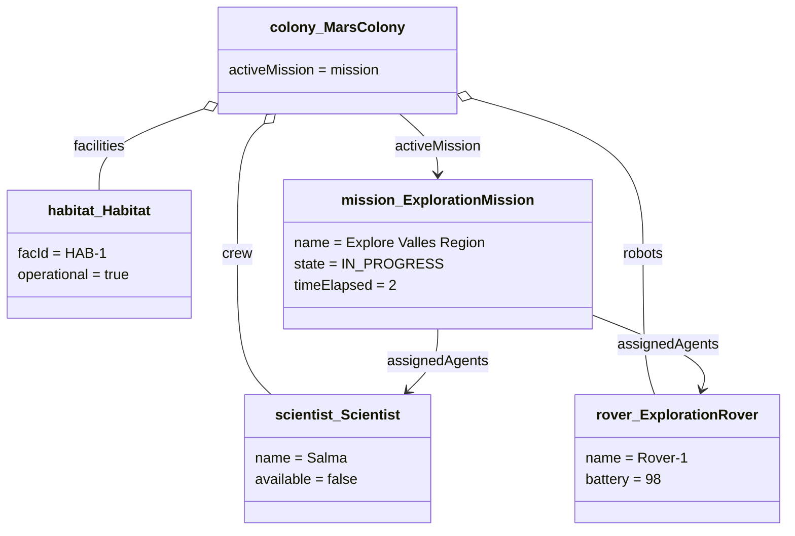

# Object Diagram

```mermaid
classDiagram
    class colony_MarsColony {
      activeMission = mission
    }
    class scientist_Scientist {
      name = Salma
      available = false
    }
    class rover_ExplorationRover {
      name = Rover-1
      battery = 98
    }
    class habitat_Habitat {
      facId = HAB-1
      operational = true
    }
    class mission_ExplorationMission {
      name = Explore Valles Region
      state = IN_PROGRESS
      timeElapsed = 2
    }
    colony_MarsColony o-- scientist_Scientist : crew
    colony_MarsColony o-- rover_ExplorationRover : robots
    colony_MarsColony o-- habitat_Habitat : facilities
    colony_MarsColony --> mission_ExplorationMission : activeMission
    mission_ExplorationMission --> scientist_Scientist : assignedAgents
    mission_ExplorationMission --> rover_ExplorationRover : assignedAgents
```

Snapshot of one colony with one crew member, one robot, one facility, and one active mission.
