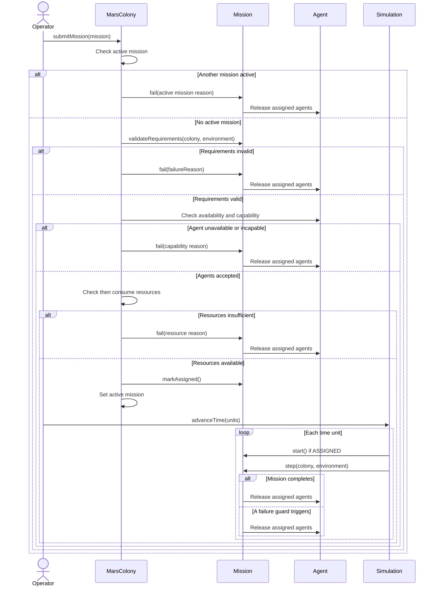

# Sequence A: Mission Execution

```mermaid
sequenceDiagram
    actor Operator
    participant Colony as MarsColony
    participant Mission
    participant Agent
    participant Simulation
    Operator->>Colony: submitMission(mission)
    Colony->>Colony: Check active mission
    alt Another mission active
        Colony->>Mission: fail(active mission reason)
        Mission->>Agent: Release assigned agents
    else No active mission
        Colony->>Mission: validateRequirements(colony, environment)
        alt Requirements invalid
            Colony->>Mission: fail(failureReason)
            Mission->>Agent: Release assigned agents
        else Requirements valid
            Colony->>Agent: Check availability and capability
            alt Agent unavailable or incapable
                Colony->>Mission: fail(capability reason)
                Mission->>Agent: Release assigned agents
            else Agents accepted
                Colony->>Colony: Check then consume resources
                alt Resources insufficient
                    Colony->>Mission: fail(resource reason)
                    Mission->>Agent: Release assigned agents
                else Resources available
                    Colony->>Mission: markAssigned()
                    Colony->>Colony: Set active mission
                    Operator->>Simulation: advanceTime(units)
                    loop Each time unit
                        Simulation->>Mission: start() if ASSIGNED
                        Simulation->>Mission: step(colony, environment)
                        alt Mission completes
                            Mission->>Agent: Release assigned agents
                        else A failure guard triggers
                            Mission->>Agent: Release assigned agents
                        end
                    end
                end
            end
        end
    end
```
