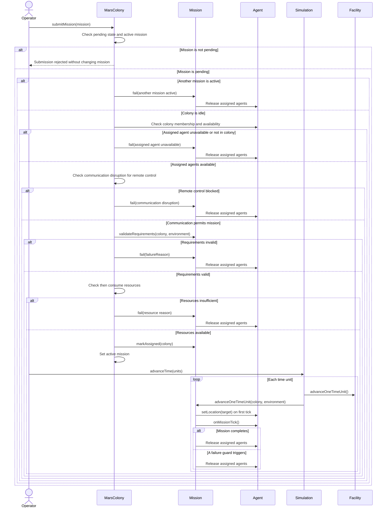

# Sequence A: Mission Execution

```mermaid
sequenceDiagram
    actor Operator
    participant Colony as MarsColony
    participant Mission
    participant Agent
    participant Simulation
    Operator->>Colony: submitMission(mission)
    Colony->>Colony: Check pending state and active mission
    alt Mission is not pending
        Colony-->>Operator: Submission rejected without changing mission
    else Mission is pending
        alt Another mission is active
            Colony->>Mission: fail(another mission active)
            Mission->>Agent: Release assigned agents
        else Colony is idle
        Colony->>Agent: Check colony membership and availability
        alt Assigned agent unavailable or not in colony
            Colony->>Mission: fail(assigned agent unavailable)
            Mission->>Agent: Release assigned agents
        else Assigned agents available
            Colony->>Colony: Check communication disruption for remote control
            alt Remote control blocked
                Colony->>Mission: fail(communication disruption)
                Mission->>Agent: Release assigned agents
            else Communication permits mission
                Colony->>Mission: validateRequirements(colony, environment)
                alt Requirements invalid
                    Colony->>Mission: fail(failureReason)
                    Mission->>Agent: Release assigned agents
                else Requirements valid
                    Colony->>Colony: Check then consume resources
                    alt Resources insufficient
                        Colony->>Mission: fail(resource reason)
                        Mission->>Agent: Release assigned agents
                    else Resources available
                        Colony->>Mission: markAssigned(colony)
                        Colony->>Colony: Set active mission
                        Operator->>Simulation: advanceTime(units)
                        loop Each time unit
                            Simulation->>Facility: advanceOneTimeUnit()
                            Simulation->>Mission: advanceOneTimeUnit(colony, environment)
                            Mission->>Agent: setLocation(target) on first tick
                            Mission->>Agent: onMissionTick()
                            alt Mission completes
                                Mission->>Agent: Release assigned agents
                            else A failure guard triggers
                                Mission->>Agent: Release assigned agents
                            end
                        end
                    end
                end
            end
        end
        end
    end
```
