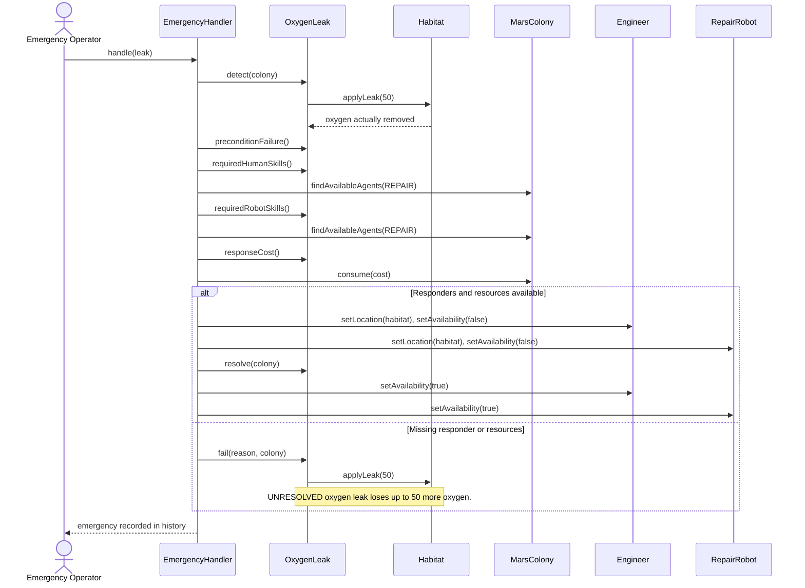

# Sequence B: Oxygen Leak Emergency

```mermaid
sequenceDiagram
    actor Operator as Emergency Operator
    participant Handler as EmergencyHandler
    participant Leak as OxygenLeak
    participant Habitat
    participant Colony as MarsColony
    participant Engineer
    participant RepairRobot
    Operator->>Handler: handle(leak)
    Handler->>Leak: detect(colony)
    Leak->>Habitat: applyLeak(50)
    Habitat-->>Leak: oxygen actually removed
    Handler->>Leak: preconditionFailure()
    Handler->>Leak: requiredHumanSkills()
    Handler->>Colony: findAvailableAgents(REPAIR)
    Handler->>Leak: requiredRobotSkills()
    Handler->>Colony: findAvailableAgents(REPAIR)
    Handler->>Leak: responseCost()
    Handler->>Colony: consume(cost)
    alt Responders and resources available
      Handler->>Engineer: setLocation(habitat), setAvailability(false)
      Handler->>RepairRobot: setLocation(habitat), setAvailability(false)
      Handler->>Leak: resolve(colony)
      Handler->>Engineer: setAvailability(true)
      Handler->>RepairRobot: setAvailability(true)
    else Missing responder or resources
      Handler->>Leak: fail(reason, colony)
      Leak->>Habitat: applyLeak(50)
      Note over Leak,Habitat: UNRESOLVED oxygen leak loses up to 50 more oxygen.
    end
    Handler-->>Operator: emergency recorded in history
```
