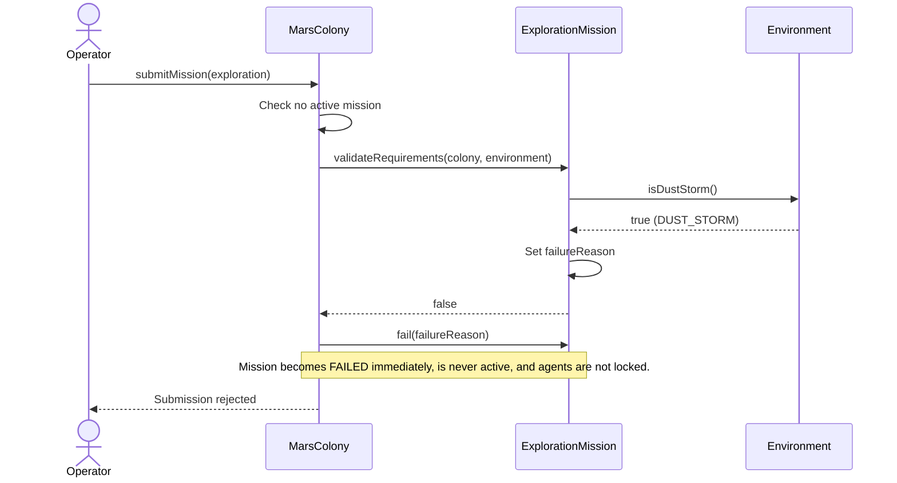

# Sequence C: Dust Storm Rejection

```mermaid
sequenceDiagram
    actor Operator
    participant Colony as MarsColony
    participant Mission as ExplorationMission
    participant Environment
    Operator->>Colony: submitMission(exploration)
    Colony->>Colony: Check no active mission
    Colony->>Mission: validateRequirements(colony, environment)
    Mission->>Environment: isDustStorm()
    Environment-->>Mission: true (DUST_STORM)
    Mission->>Mission: Set failureReason
    Mission-->>Colony: false
    Colony->>Mission: fail(failureReason)
    Note over Mission,Colony: Mission becomes FAILED immediately, is never active, and agents are not locked.
    Colony-->>Operator: Submission rejected
```
