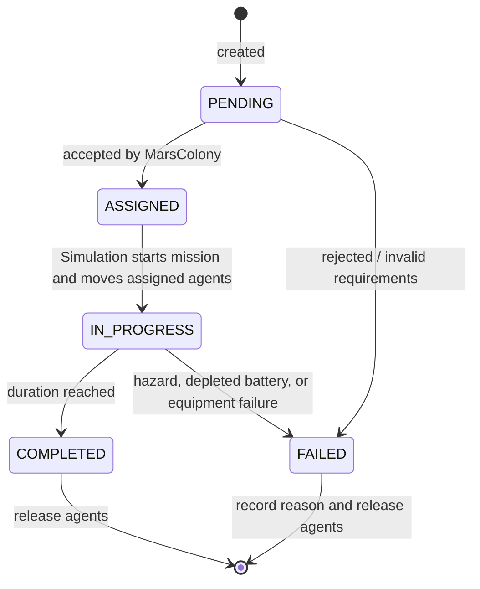

# Mission State Machine

```mermaid
stateDiagram-v2
    [*] --> PENDING: created
    PENDING --> ASSIGNED: accepted by MarsColony
    PENDING --> FAILED: rejected / invalid requirements
    ASSIGNED --> IN_PROGRESS: Simulation starts mission and moves assigned agents
    IN_PROGRESS --> COMPLETED: duration reached
    IN_PROGRESS --> FAILED: hazard, depleted battery, or equipment failure
    COMPLETED --> [*]: release agents
    FAILED --> [*]: record reason and release agents
```
